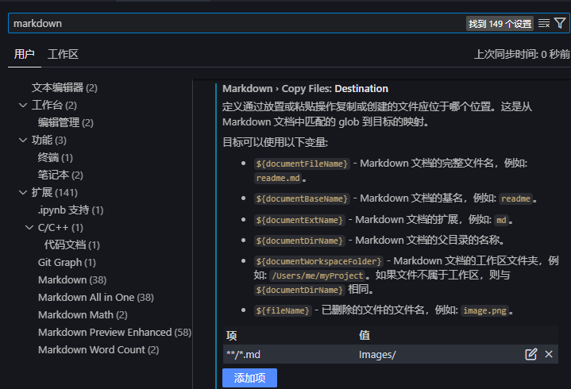

---
html:
  embed_local_images: true
  embed_svg: true
  offline: false

print_background: true

export_on_save:
  html: true

toc: 
  depth_from: 1
  depth_to: 3
  ordered: true
---

# Markdown学习笔记
## Markdown环境配置（VS Code）

### 设置Markdown图片存放位置
1. 在VS Code中，按下`Ctrl + ,`，打开设置界面。
2. 在搜索框中输入`markdown.copy`, 找到`Markdown> Copy Files:Destination`
3. 新增配置项 key 为 "`**/*.md`" , value的值为保存路径。比如我想将图片放在当前markdown文件同名的目录下，那么我就可以设置做如下设置
   
<center>
  
</center>

###自定义 CSS
>由插件Markdown Preview Enhanced支持

按下`cmd-shift-p`，然后运行 **Markdown Preview Enhanced: Customize CSS (Global)** 或 **Markdown Preview Enhanced: Customize CSS (Workspace)** 命令。
`style.less` 文件将会被打开，然后你就可以编写样式。

```css
.markdown-preview.markdown-preview {
  // 在这里编写你的样式
  // 例如：
  //  color: blue;          // 改变字体颜色
  //  font-size: 14px;      // 改变字体大小
  // 自定义 pdf 导出样式
  @media print {
  }

  // 自定义 prince pdf 导出样式
  &.prince {
  }

  // 自定义 presentation 样式
  .reveal .slides {
    // 修改所有幻灯片
  }

  // 自定义 presentation 样式
  .slides > section:nth-child(1) {
    // 修改 `第 1 个幻灯片`
  }
}

.md-sidebar-toc.md-sidebar-toc {
  // 边栏目录样式
}
```


自用的全局样式
```css
/**
 *二级到四级标题带数字序号
 */
 body {
  counter-reset: hbody;  //创建计数器
}
  

h2 {
  counter-reset: h2;
}

h3 {
  counter-reset: h3;
}

h4 {
  counter-reset: h4;
}

h5 {
  counter-reset: h5;
}

/**
 * 把 h1 当成文章题目，从 h2 开始自动编号
 */
h2:before {
  counter-increment: hbody;       //计数器加一
  content: counter(hbody) " ";    //插入序号
}

h3:before {
  counter-increment: h2;
  content: counter(hbody) "." counter(h2) " ";
}

h4:before {
  counter-increment: h3;
  content: counter(hbody) "." counter(h2) "." counter(h3)  " ";
}
.markdown-preview.markdown-preview {
  // modify your style here
  // eg: background-color: blue;
}
```
### front-matter设置
>由插件Markdown Preview Enhanced支持  

```css
---
html:
  embed_local_images: true
  embed_svg: true
  offline: false

print_background: true

export_on_save:
  html: true

toc: 
  depth_from: 1
  depth_to: 3
  ordered: true
----
```

## Markdown语法

### 表格

表格可以用于文字，也可以用于图片。在对纯文本使用表格时，可用Markdown语法
```

   | XX  | XX  | XX  | //此行为表头  
   | -: | -: | -: |    //此行为居中方式  输入好后回车
   | A   |  B  | C   |
   | DAS | SD  | SD  |
```

效果如下:

   | XX  | XX  | XX  |
   | -: | -: | -: |
   | A   |  B  | C   |
   | DAS | SD  | SD|

当想对图片进行多张并列排版时，可以使用html中的\<table>标签

```html
<table>
  <tr>
      <td></td>
      <td></td>
      <td></td>
  </tr>
  
  <tr>
      <td><center>图1</center></td>
      <td><center>图2</center></td>
      <td><center>图3</center></td>
  </tr>
</table>

```

效果如下
<table>
  <tr>
      <td></td>
      <td></td>
      <td></td>
  </tr>
  
  <tr>
      <td><center>图1</center></td>
      <td><center>图2</center></td>
      <td><center>图3</center></td>
  </tr>
</table>

单元格合并

跨行合并 , 要在 <td> 标签中 使用 rowspan 属性：

```html
<table>
  <tr>
    <td  rowspan="2"><center>cell1</center></td>
    <td><center>cell2</center></td>
    <td><center>cell3</center></td>
  </tr>
  <tr>
    <td><center>cell4</center></td> 
    <td><center>cell5</center></td> 
  </tr>
</table>
```
效果如下：
<table>
  <tr>
    <td  rowspan="2"><center>cell1</center></td>
    <td><center>cell2</center></td>
    <td><center>cell3</center></td>
  </tr>
  <tr>
    <td><center>cell4</center></td> 
    <td><center>cell5</center></td> 
  </tr>
</table>
跨列合并 , 要在 <td> 标签中 使用 colspan 属性：

```html
<table>
  <tr>
    <td  colspan="2"><center>cell1</center></td>
  </tr>
  <tr>
    <td><center>cell2</center></td> 
    <td><center>cell3</center></td> 
  </tr>
</table>
```

效果如下：
<table>
  <tr>
    <td  colspan="2"><center>cell1</center></td>
  </tr>
  <tr>
    <td><center>cell2</center></td> 
    <td><center>cell3</center></td> 
  </tr>
</table>


### 字体属性设置
Markdown 通过简单标记语法，使普通文本内容具有一定格式。但它本身不支持修改字体、字号与颜色等功能的。

#### 修改文字颜色
通过\<font>标签的`color`属性进行设置
```html
<font color=red>修改文字颜色</font>  
```
效果如下
<font color=red>修改文字颜色</font>  

常用的文字颜色如下

<table>
  <tr>
      <td><center><font color=blue size=5>蓝色（blue）</font></center></td>
      <td><center><font color=grey size=5>灰色（grey）</font></center></td>
      <td><center><font color=green size=5>绿色（green） </font></center></td>
  </tr>
  <tr>
      <td><center><font color=orange size=5>橙色（orange）</font></center></td>
      <td><center><font color=red size=5>红色(red) </font></center></td>
      <td><center><font color=yellow size=5>黄色（yellow）</font></center></td>
  </tr>
</table>


#### 修改文字尺寸
```html

<font size=10>修改文字尺寸</font>
```

<font size=10>修改文字尺寸</font>

## Markdown快捷键

| 快捷键       | 作用     | 类型   | 备注                                      |
| ------------ | -------- | ------ | ----------------------------------------- |
| Ctrl+.       | 输入建议 | 自定义 | 触发器建议快捷键设置（Trigger Suggest项） |
| Ctrl+Shift+O | 标题跳转 | 默认   | 前往标题                                  |
